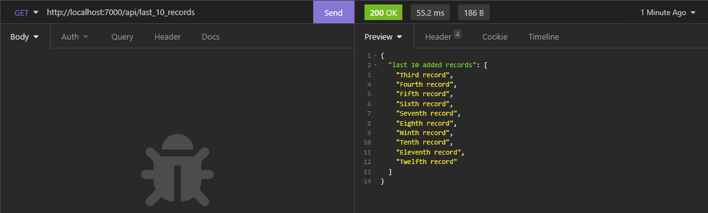
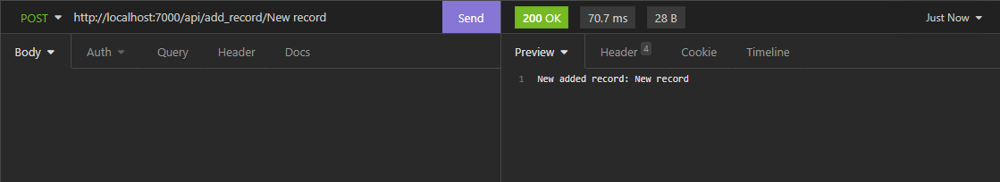
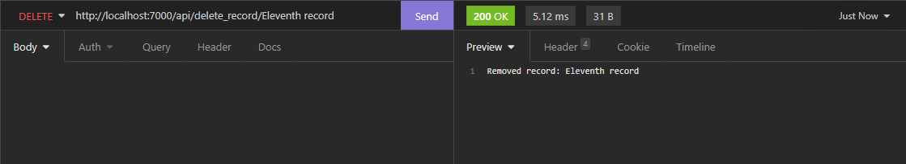
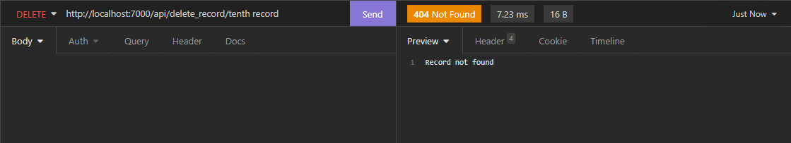

# 1. Develop a RESTful API server that will accept three types of requests: GET, POST, and DELETE

I developed my RESTful API using the FastAPI framework. The server is running with Uvicorn. The entire API is imlpemented in [main.py](main.py). 

To start the API server, just run the file:
```shell
python main.py
```

The API server has three endpoints:

- `http://localhost:8080/api/last_10_records` - returns last 10 record (handles GET requests)
- `http://localhost:8080/api/add_record/<record>` - adds a record `<record>` (handles POST requests)
- `http://localhost:8080/api/delete_record/<record>` - removes a record `<record>` if it is found (handles DELETE requests)

Here, each possible record `<record>` can be represented as a string.

# 2. Create a Dockerfile in which install Python, add working folder `code` and move `main.py` to this folder

Docker image can be built based on [Dockerfile](Dockerfile). There, a new image is built from `python:3.11` image, the working directory `code` is defined, where all the necessary files are copied, the packages specified in [requirements.txt](requirements.txt) are installed, and the API server is started.

# 3. Run the container and send requests to check the RESTful API server

First, I needed to build the Docker image. So, I build `de-api` image by running the command:
```shell
docker build -t de-api .
```

Then, I ran
```shell
docker run -d -p 127.0.0.1:7000:8080 de-api
```
to start the server within the Docker container binding 8080 port of the container to 7000 port on localhost address of the host.

To test the RESTful API, I used [Insomnia](https://insomnia.rest/) tool. Below are screenshots of checking GET, POST, and DELETE requests:

- Get 10 last records

<div style="text-align: center;">
    
</div>

- Add new record

<div style="text-align: center;">
    
</div>

- Remove record (successfully)

<div style="text-align: center;">
    
</div>

- Remove record (failed)

<div style="text-align: center;">
    
</div>
