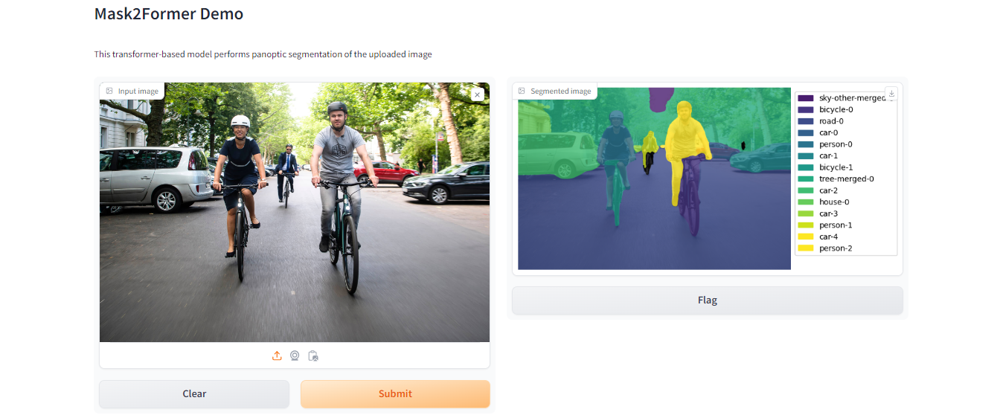

# Panoptic Segmentation with Mask2Former model

## Overview

This project implements a demo that uses Mask2Former transformer-based model for panoptic segmentation of an image. Panoptic segmentation divides the image into semantically meaningful regions, while also detecting and distinguishing individual instances of objects within those regions. 

## Deployment Info

The demo runs on the web server with GUI built on Gradio framework. The GUI accepts an image, uses the Mask2Former model, and returns a segmented image. The web server runs within a Docker container.

## Installation Instruction

1. Download the script files `demo.py` and `inference.py` and install Docker if needed.
2. Build Docker image `<image-name>` running command:
```
docker build -t <image-name> .
```
3. To launch the demo, run Docker container with internal port 7000 (configured in Dockerfile): 
```
docker run -p <external-port>:7000 <image-name>
```

Then you can access the demo on a web browser at `http://127.0.0.1:<external-port>`.

## Modeling Info

Mask2Former model trained on COCO panoptic segmentation. Mask2Former addresses instance, semantic and panoptic segmentation with the same paradigm: by predicting a set of masks and corresponding labels. Hence, all 3 tasks are treated as if they were instance segmentation. Mask2Former outperforms the previous SOTA, MaskFormer both in terms of performance an efficiency by (i) replacing the pixel decoder with a more advanced multi-scale deformable attention Transformer, (ii) adopting a Transformer decoder with masked attention to boost performance without without introducing additional computation and (iii) improving training efficiency by calculating the loss on subsampled points instead of whole masks.

## Interface Description

Input: Gradio image component where user can upload an image to perform segmentation.

Output: Gradio image component where a segmented image is displayed that the user can download.

## Example


